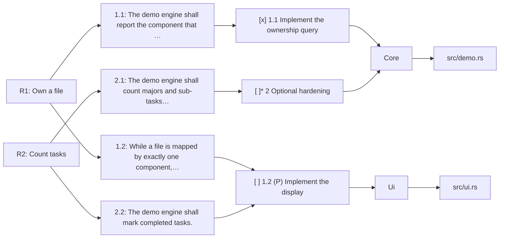

Graph for demo: 2 requirements, 4 criteria, 3 tasks, 2 components, 2 files; 13 edges
Unscoped tasks: 0; unassigned files: 0; unresolved references: 0

```mermaid
graph LR
    req_1["R1: Own a file"]
    class req_1 req
    crit_1_1["1.1: The demo engine shall report the component that …"]
    class crit_1_1 crit
    crit_1_2["1.2: While a file is mapped by exactly one component,…"]
    class crit_1_2 crit
    req_2["R2: Count tasks"]
    class req_2 req
    crit_2_1["2.1: The demo engine shall count majors and sub-tasks…"]
    class crit_2_1 crit
    crit_2_2["2.2: The demo engine shall mark completed tasks."]
    class crit_2_2 crit
    task_1_1["[x] 1.1 Implement the ownership query"]
    class task_1_1 task_done
    task_1_2["[ ] 1.2 (P) Implement the display"]
    class task_1_2 task
    task_2["[ ]* 2 Optional hardening"]
    class task_2 task
    comp_Core["Core"]
    class comp_Core comp
    file_src_demo_rs["src/demo.rs"]
    class file_src_demo_rs file
    comp_Ui["Ui"]
    class comp_Ui comp
    file_src_ui_rs["src/ui.rs"]
    class file_src_ui_rs file
    req_1 --> crit_1_1
    req_1 --> crit_1_2
    req_2 --> crit_2_1
    req_2 --> crit_2_2
    crit_1_1 --> task_1_1
    crit_1_2 --> task_1_2
    crit_2_2 --> task_1_2
    crit_2_1 --> task_2
    task_1_1 --> comp_Core
    task_1_2 --> comp_Ui
    task_2 --> comp_Core
    comp_Core --> file_src_demo_rs
    comp_Ui --> file_src_ui_rs
```
