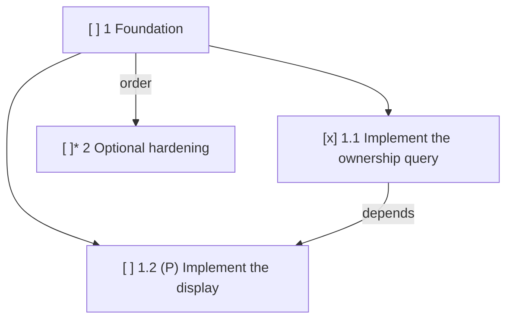

Tasks for demo: 1/4 done; 2 majors; parallel 1; optional 1
Dependencies: 1 explicit (0 unknown); 1 ordering edges; 2 containment edges

```mermaid
graph TD
    task_1["[ ] 1 Foundation"]
    class task_1 major
    task_1_1["[x] 1.1 Implement the ownership query"]
    class task_1_1 task_done
    task_1_2["[ ] 1.2 (P) Implement the display"]
    class task_1_2 task
    task_2["[ ]* 2 Optional hardening"]
    class task_2 major
    task_1 --> task_1_1
    task_1 --> task_1_2
    task_1 -->|"order"| task_2
    task_1_1 -->|"depends"| task_1_2
```
